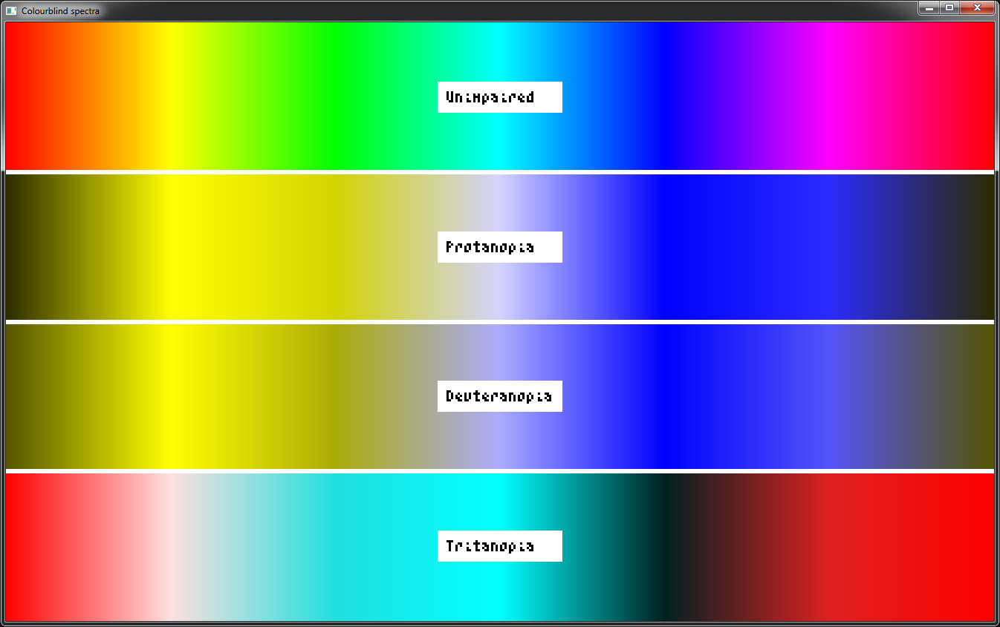

# Colourblind
*A C header file & shader for simulating colourblindness and checking contrast.*

Make sure that your graphic design is suitable for the ~8% of your users who are colourblind.

## Contents

- [Demo](#demo)
- [Background understanding](#background-understanding)
- [Simple example](#simple-example)
- [C API](#c-api)
    - [Functions](#functions)
    - [Types](#types)
    - [Constants](#constants)
    - [Compile-time options](#compile-time-options)
    	- [Gamma](#gamma)
    	- [American spelling](#american-spelling)
- [Shader 'API'](#shader-api)
- [Acknowledgements](#acknowledgements)
- [Donations and Support](#donations-and-support)
- [Recommended Libraries](#recommended-Libraries)
- [License](#license)


## Demo


*see the code for this in [examples/colourblind_spectra.c](examples/colourblind_spectra.c)*

*If you're wondering where you can get the awesome font above for your C projects, check out [blit-fonts](https://github.com/azmr/blit-fonts)*

## Background understanding
Human colour vision relies on 4 types of structure in the eye: 3 types of 'cones' + 'rods'.
Rods aren't too relevant here, so they'll be ignored from now on.

The cones respond to light by producing a signal, the strength of which depends on the wavelength of the light.

The three different cones respond to different (but overlapping) wavelength bands (Long ~= Red, Medium ~= Green, Short ~= Blue), and the combination of their signals gives us the colour image that most people see.


Colourblindness occurs when one or more of these cones is either malfunctioning or missing,
reducing the range of colours that can be seen.
The terms, e.g. where the long-wavelength cone is concerned, are:
Protanomoly - L cone malfunctioning
Protanopia  - L cone missing/not working at all

\__nomoly is a milder version of \__nopia, so I only include the latter here.

## Simple Example
```c
#include <stdio.h>
#define cbIMPLEMENTATION
#include "colourblind.h"

int main() {
    cb_rgb Purple = { 0.8f, 0.1f, 0.6f };
    cb_rgb Green  = { 0.1f, 0.8f, 0.2f };

    float WorstImpairmentContrast = 21.f;         // maximum possible contrast for the test used
    cb_impairment WorstImpairment = cbUnimpaired; // == 0

    for(cb_impairment Impairment = cbUnimpaired; Impairment < cbImpairmentCount; ++Impairment) {
        cb_rgb PurpleImpaired = ColourblindRGB(Impairment, Purple);
        cb_rgb GreenImpaired  = ColourblindRGB(Impairment, Green);

        float ImpairmentContrast = cbContrastRGB(PurpleImpaired, GreenImpaired);
        if(ImpairmentContrast < WorstImpairmentContrast) {
            WorstImpairment = Impairment;
            WorstImpairmentContrast = ImpairmentContrast;
        }
    }

    char *PassFail = WorstImpairmentContrast >= cbGuidelineScores[cbWCAG_Contrast_AA]
                   ? "passes"
                   : "fails";
    printf("\nThe contrast was worst in the %s condition, with a value of %4f:1\n"
           "This %s the WCAG AA requirement.",
            cbImpairmentStrings[WorstImpairment], WorstImpairmentContrast, PassFail);

    return 0;
}
```
*This is expanded upon slightly in [examples/colourblind_worst_contrast.c](examples/colourblind_worst_contrast.c)*

## C API

### Functions
Wherever applicable, the functions below are all provided in multiple formats:
```c
void Function(float *R, float *G, float *B);
void Function255(unsigned char *R, unsigned char *G, unsigned char *B);
cb_rgb FunctionRGB(cb_rgb RGB);
cb_rgb_255 FunctionRGB255(cb_rgb_255 RGB);
```
Pointers are used as in and out variables.

```c
/* CONVERSIONS */
/* Conversions from normal rgb values to their colourblind equivalent for simulating different impairments.
 * The conversion depends on the cone that you are simulating as non-functioning. */

/* Missing the first/long-wave/red cone - Red-Green colourblind */
void Protanopia(float *Red, float *Green, float *Blue);

/* Missing the second/medium-wave/green cone - Red-Green colourblind 
 * This is the most common form of colourblindness */
void Deuteranopia(float *Red, float *Green, float *Blue);

/* Missing the third/short-wave/blue cone - Blue-Yellow colourblind */
void Tritanopia(float *Red, float *Green, float *Blue);

/* Applies the above impairment simulation (or no-op) based on the enum value given (see Types) */
void Colourblind(cb_impairment Impairment, float *R, float *G, float *B);


/* SCORES */
/* WCAG-defined contrast: (L_H+0.5) / (L_L+0.5) */
/* Results range from 1 (the same colour) to 21 (white with black) */
float cbContrast(float RA, float GA, float BA, float RB, float GB, float BB);

/* ISO 9241-3 contrast modulation: (L_H-L_L) / (L_H+L_L) */
float cbContrastModulation(float RA, float GA, float BA, float RB, float GB, float BB);

/* ISO 9241-3 contrast ratio: L_H / L_L (divides by zero for pure black) */
float cbContrastRatio(float RA, float GA, float BA, float RB, float GB, float BB);

/* Gives a 'lightness' value for comparing colours */
float cbLuminance(float R, float G, float B);


/* UTILITIES */
/* Convert between 0-255 and 0-1 */
cb_rgb     cbNorm(cb_rgb_255 RGB);
cb_rgb_255 cbDenorm(cb_rgb RGB);

/* Convert from Linear to sRGB */
void   cbApplyGamma(float *R, float *G, float *B);

/* Convert from sRGB to Linear */
void   cbRemoveGamma(float *R, float *G, float *B);
```

### Types
```c
/* Both structs have members R, G, B, for Red, Green, Blue, respectively */
typedef struct cb_rgb_255 cb_rgb_255; /* 0 - 255 */
typedef struct cb_rgb cb_rgb; /* 0.0f - 1.0f */
```

I've given the specifiers a few different names for the different forms of colourblindness:
```c
enum cb_impairment {
    cbUnimpaired,
    cbProtanopia,   /* = cbRedGreenDim = cbMissingRed   */
    cbDeuteranopia, /* = cbRedGreen    = cbMissingGreen */
    cbTritanopia,   /* = cbBlueYellow  = cbMissingBlue  */
    cbImpairmentCount /* = 4 */
};
```

There are also indices into some guideline scores:
```c
enum cb_guideline {
    cbISO9241_3_ContrastRatio_Pass,
    cbWCAG_Contrast_AALarge,
    cbWCAG_Contrast_AAALarge,
    cbWCAG_Contrast_AA,
    cbWCAG_Contrast_AAA,
    cbISO9241_3_ContrastModulation,
};
```

### Constants
```c
/* Indexed by cb_impairment enum values */
char *cbImpairmentStrings[];

/* Indexed by cb_guideline enum values */
char *cbGuidelineStrings[];
float cbGuidelineScores[];
```

### Compile-time options
#### Gamma
By default, any gamma-correction is done with the most accurate method I'm aware of.
If you need it to be faster for some reason, I have provided 2 approximations that
progressively increase speed and decrease accuracy:
```c
#define cbGAMMA_FAST
#define cbGAMMA_FASTER
```
Check the implementations to see if you are comfortable with the trade-off.

The accurate and fast versions use `pow` and the faster version uses `sqrt`.
These automatically `#include <math.h>` unless you redefine:
```c
#define cbPOW
#define cbSQRT
```
(whichever is relevant).

#### American spelling
If you are American and feel uncomfortable using the proper spelling of 'colour'
(e.g. for `Colourblind`), I have very graciously provided you with the following override:
```c
#define I_PREFER_THE_AMERICAN_SPELLING_OF_COLOR_BECAUSE_I_AM_SILLY
```
This lets you call `Colorblind`.

## Shader 'API'
I've just provided all the conversion matrices so that they can be copied and pasted into your code.
You can simply premultiply the RGB matrices against a `vec3` of your colour to get the colourblind equivalent:

```glsl
vec3 Colour = vec3(R, G, B);
vec3 ImpairedColour = M_Protanopia * Colour;
ReturnColour = vec4(ImpairedColour, 1.0);
```

I haven't used shaders a huge amount, so if you have a preferred format let me know
(file an issue) and I'll consider changing/adding it.

## Acknowledgements/references

 - [Color Blindness Simulation Research](http://ixora.io/projects/colorblindness/color-blindness-simulation-research/) - this article really helped me piece together the disparate bits of knowledge I had on the topic.
 - [Bruce Lindbloom's site](http://www.brucelindbloom.com) - this had lots of detailed info (and matrices!) on colour-space conversion.
 - [WCAG](http://www.w3.org/TR/2008/REC-WCAG20-20081211/#contrast-ratiodef) - Web guidelines for contrast.
 - ISO 9241-3 - International standards for contrast.

## Donations and Support
If this tool was helpful to you or saved you some time and effort,
please consider supporting its development (along with other free tools): 

[Donate via PayPal](https://www.paypal.me/azmreece/10)

[](https://ko-fi.com/O4O3F3TN)
<a href='https://ko-fi.com/O4O3F3TN' target='_blank'></a>

If you don't have the means or otherwise don't want to donate but still found the library useful,
there are other ways you can help out:

 - I'd love to hear about how you've used the library, even if you don't think it's a very interesting use-case. 
It's often unclear how much people are using code from online repos; a bit of positive feedback goes a long way in motivation.
 - Share this page on social media or with a couple of people who you think would find it useful. 

## Recommended Libraries
- [blit fonts](https://github.com/azmr/blit-fonts) - my family of small, fast, and simple bitmap fonts in single-file C headers
- [sweet](https://github.com/azmr/sweet) - my single-header C test suite
- [live_edit](https://github.com/azmr/live_edit) - my single-header C library-loading/tweaking/debugging/profiling tools
- [STB libraries](https://github.com/nothings/stb) - lots of excellent single-header libraries
- [hg_sdf](http://mercury.sexy/hg_sdf/) - signed distance field shader functions (there's also a [WebGL compatible port](https://github.com/jcowles/hg_sdf))

## License

```
ISC License
Copyright (c) 2018 Andrew Reece

Permission to use, copy, modify, and/or distribute this software for any
purpose with or without fee is hereby granted, provided that the above
copyright notice and this permission notice appear in all copies.

THE SOFTWARE IS PROVIDED "AS IS" AND THE AUTHOR DISCLAIMS ALL WARRANTIES
WITH REGARD TO THIS SOFTWARE INCLUDING ALL IMPLIED WARRANTIES OF
MERCHANTABILITY AND FITNESS. IN NO EVENT SHALL THE AUTHOR BE LIABLE FOR
ANY SPECIAL, DIRECT, INDIRECT, OR CONSEQUENTIAL DAMAGES OR ANY DAMAGES
WHATSOEVER RESULTING FROM LOSS OF USE, DATA OR PROFITS, WHETHER IN AN
ACTION OF CONTRACT, NEGLIGENCE OR OTHER TORTIOUS ACTION, ARISING OUT OF
OR IN CONNECTION WITH THE USE OR PERFORMANCE OF THIS SOFTWARE.
```

If this license is not suitable for your circumstances, please let me know and I'll see what I can do to make it work for you.
